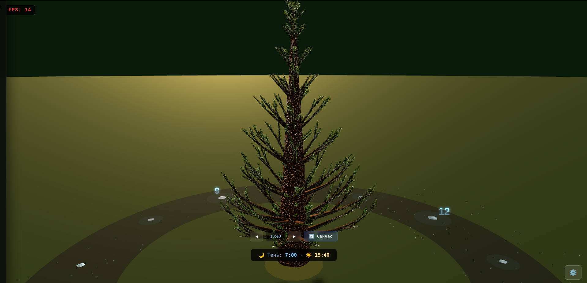
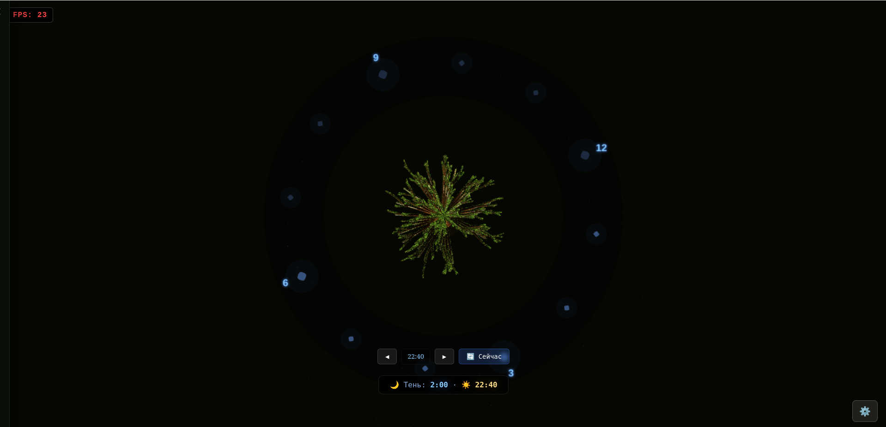
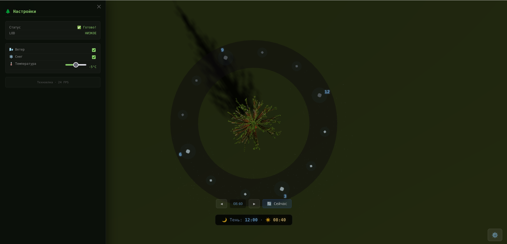

<div align="center">
  
# 🌲 TechTree v1.0.0


> 🎄 Интерактивная 3D-модель ели с динамическим освещением и управлением временем  
> 🌙 Реалистичные тени • Управление солнцем • Циферблат в стиле ночного неба

</div>

---

## 📋 Оглавление
- [📖 О проекте](#-о-проекте)
- [✨ Возможности](#-возможности)
- [📸 Демонстрация](#-демонстрация)
- [📥 Установка и запуск](#-установка-и-запуск)
- [🎮 Использование](#-использование)
- [🛠 Технологии](#-технологии)
- [🏗 Архитектура проекта](#-архитектура-проекта)
- [🌙 Управление временем](#-управление-временем)
- [🔧 Настройки](#-настройки)
- [📱 Совместимость](#-совместимость)
- [🔧 Решение проблем](#-решение-проблем)
- [📄 Лицензия](#-лицензия)

---

## 📖 О проекте

**TechTree** — это интерактивное 3D-приложение, демонстрирующее детализированную модель ели с реалистичной корой, тысячами иголок, снегом на ветках и динамическим освещением от солнца. Проект создан для изучения возможностей **Three.js** в области процедурной генерации и визуализации.

### ✨ Возможности

| Фича | Описание |
|------|----------|
| 🎄 **Процедурная генерация** | Ствол, ветки и хвоя создаются алгоритмически с уникальной текстурой |
| 🌞 **Динамическое освещение** | Солнце движется по небу, меняя тени и атмосферу |
| 🌙 **Циферблат ночного неба** | Декоративный циферблат с ромбиками, звёздами и подсветкой |
| ❄️ **Снег на ветках** | Снежные шапки, повторяющие форму ветвей |
| 🎮 **Интерактивное управление** | Вращение камеры, управление временем суток |
| ⚙️ **Настройки в реальном времени** | Ветер, снег, температура — всё настраивается |
| 📊 **LOD-система** | Автоматическое снижение детализации для производительности |

---

## 📸 Демонстрация

<div align="center">

| 🌲 Ель в полный рост | 🌙 Циферблат | ⚙️ Панель настроек |
|:--------------------:|:------------:|:------------------:|
|  |  |  |
| *Вид на модель с высоты* | *Ночной циферблат со звёздами* | *Управление погодой и временем* |

</div>

---

## 📥 Установка и запуск

### ⚡ Быстрый старт

```bash
# 1. Клонируйте репозиторий
git clone https://github.com/yourusername/techtree.git
cd techtree

# 2. Установите зависимости (если используются)
npm install

# 3. Запустите локальный сервер
# Используйте любой HTTP-сервер, например:
npx serve .
# или
python -m http.server 8080

# 4. Откройте в браузере
# http://localhost:8080 (или ваш порт)
```

### 📦 Требования
- Современный браузер с поддержкой WebGL 2.0
- Интернет-соединение (для загрузки Three.js из CDN)
- 4+ ГБ ОЗУ (рекомендуется для комфортной работы)

---

## 🎮 Использование

### Управление камерой

| Действие | Управление |
|----------|------------|
| 🔄 Вращение | **Левая кнопка мыши** + перетаскивание |
| 🔍 Масштаб | **Колесо мыши** или **Ctrl + Left Click** |
| 📍 Центрирование | Двойной клик по модели |

### Управление временем

| Кнопка | Действие |
|--------|----------|
| **◀** | Переместить солнце на 30 минут назад |
| **▶** | Переместить солнце на 30 минут вперёд |
| **🔄 Сейчас** | Синхронизировать с реальным временем |

> 💡 **Совет:** Положение тени на циферблате показывает текущее время (как солнечные часы).

### Панель настроек (⚙️)

| Настройка | Описание |
|-----------|----------|
| 🌬️ **Ветер** | Включить/выключить анимацию ветра |
| ❄️ **Снег** | Показать/скрыть снег на ветках |
| 🌡️ **Температура** | Влияет на цветовую гамму снега |

---

## 🛠 Технологии

```
🟦 Three.js 0.128.0    — 3D-движок
🎮 OrbitControls       — управление камерой
🧩 ES Modules          — модульная архитектура
🎨 Canvas 2D API       — генерация текстур
📦 IndexedDB           — кэширование (планируется)
```

---

## 🏗 Архитектура проекта

```
techtree/
├── index.html          # Основная страница
├── trunk.js            # Генерация ствола с текстурой коры
├── branches.js         # Система веток (рекурсивная генерация)
├── needles.js          # Создание иголок (InstancedMesh)
├── snow.js             # Снежные шапки на ветках
├── sun.js              # Солнце + динамическое освещение
├── clock.js            # Циферблат ночного неба
├── precompute.js       # Прекомпьютинг текстур (опционально)
├── package.json        # Зависимости
└── README.md           # Документация
```

### Модули

| Модуль | Описание |
|--------|----------|
| **trunk.js** | Генерирует ствол с процедурной текстурой коры (4096×4096) |
| **branches.js** | Рекурсивно создаёт ветки с реалистичным изгибом |
| **needles.js** | Оптимизированная генерация хвои через `InstancedMesh` |
| **snow.js** | Добавляет снег на верхнюю часть веток |
| **sun.js** | Создаёт солнце с эффектом свечения и управляет тенью |
| **clock.js** | Декоративный циферблат со звёздной пылью |

---

## 🌙 Управление временем

Солнце в проекте движется по реалистичной траектории:

- **Высота** изменяется в зависимости от времени суток (максимум в полдень)
- **Тень** отбрасывается динамически, меняя направление
- **Циферблат** работает как солнечные часы — тень указывает на час

### Формула положения солнца

```javascript
const angle = -((totalMinutes / 720) * Math.PI * 2);
const elevation = Math.sin((totalMinutes / 1440) * Math.PI * 2 - Math.PI / 2);
const x = Math.sin(angle) * sunDistance * (1 - elevation * 0.3);
const y = elevation * sunHeight;
```

---

## 🔧 Настройки

### Производительность

Проект автоматически управляет качеством рендеринга:

| Расстояние до модели | LOD-уровень | Тени | Pixel Ratio |
|----------------------|-------------|------|-------------|
| **< 3.5** | Высокое | ✅ Включены | до 2.0 |
| **3.5 – 7** | Среднее | ✅ Включены | 1.0 |
| **> 7** | Низкое | ❌ Отключены | 0.8 |

### Визуальные эффекты

- **Снег** — автоматически добавляется на ветки во время генерации
- **Ветер** — влияет на положение иголок (в разработке)
- **Температура** — меняет оттенок снега (в разработке)

---

## 📱 Совместимость

| Платформа | Поддержка |
|-----------|-----------|
| 🖥️ **Windows** (Chrome, Edge, Firefox) | ✅ Полная |
| 🍎 **macOS** (Safari, Chrome) | ✅ Полная |
| 🐧 **Linux** (Firefox, Chrome) | ✅ Полная |
| 📱 **Android** (Chrome) | ⚠️ Частичная (высокая нагрузка) |
| 📱 **iOS** (Safari) | ⚠️ Частичная (высокая нагрузка) |

> 💡 Для мобильных устройств рекомендуется использовать `--pixel-ratio=1`.

---

## 🔧 Решение проблем

<details>
<summary>❌ Страница не загружается</summary>

1. Проверьте интернет-соединение (Three.js загружается из CDN)
2. Убедитесь, что используется современный браузер
3. Проверьте консоль разработчика (F12) на наличие ошибок
</details>

<details>
<summary>❌ Низкий FPS</summary>

1. Уменьшите масштаб (отдалитесь от модели) — сработает LOD
2. Закройте другие вкладки браузера
3. Включите аппаратное ускорение в настройках браузера
4. Попробуйте использовать разрешение экрана ниже
</details>

<details>
<summary>❌ Нет теней</summary>

1. Убедитесь, что камера находится ближе 7 единиц
2. Проверьте настройки браузера (WebGL должен быть включён)
3. В некоторых браузерах тени отключены по умолчанию
</details>

<details>
<summary>❌ Артефакты на текстурах</summary>

1. Обновите драйверы видеокарты
2. Попробуйте отключить антиалиасинг в настройках браузера
3. Используйте браузер на основе Chromium
</details>

---

## 🤝 Вклад в проект

Приветствуются PR и Issues! 🙌

1. Форкните репозиторий
2. Создайте ветку: `git checkout -b feature/your-feature`
3. Закоммитьте изменения: `git commit -m 'feat: add your feature'`
4. Отправьте: `git push origin feature/your-feature`
5. Откройте Pull Request

---

## 📄 Лицензия

<div align="center">

[](LICENSE)

Проект распространяется под лицензией **MIT**.

</div>

---

<div align="center">

### 🙏 Благодарности

- **Three.js** — за мощный 3D-движок 🟦
- **Сообщество Three.js** — за отличные примеры и документацию 📚
- **Вдохновение** — зимние леса и новогодние ёлки 🎄

---

**TechTree** — исследуйте красоту процедурной природы! 🌲✨

*Сделано с ❤️ на JavaScript и Three.js*

</div>
